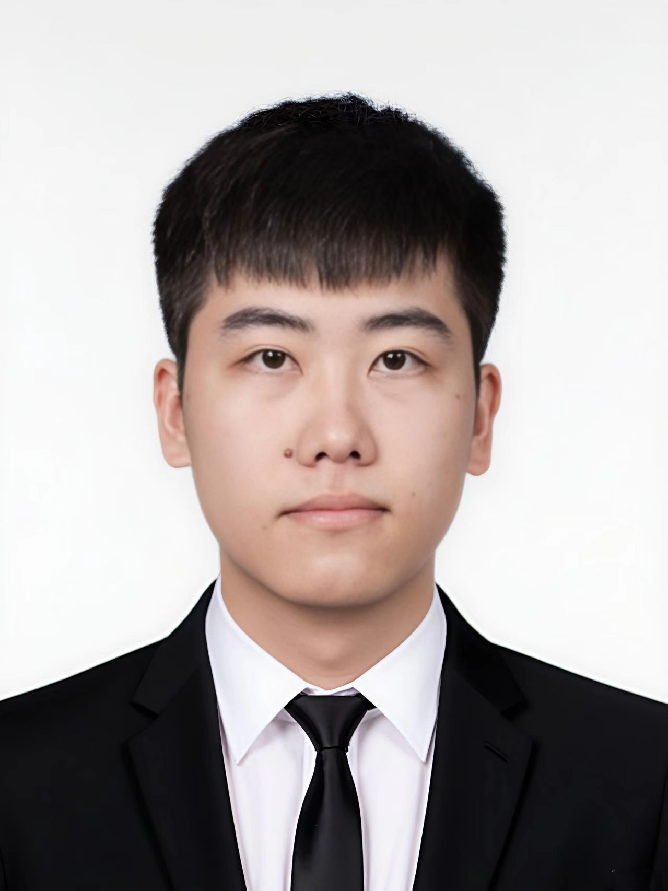

# 照片使用说明

## 当前状态
✅ 网站已更新为支持真实照片显示
✅ 目前使用占位图片，显示"裴宇航"文字
✅ 照片样式已优化，具有专业的圆形头像效果

## 如何添加真实照片

### 方法一：GitHub 网页界面上传
1. 访问仓库：https://github.com/YuhangPei/yuhang-academic-homepage
2. 点击 `Add file` → `Upload files`
3. 上传您的照片文件，建议命名为 `profile.jpg`
4. 提交更改

### 方法二：修改 HTML 文件
1. 在仓库中点击 `index.html` 文件
2. 点击编辑按钮（铅笔图标）
3. 找到第 48 行的照片标签：
   ```html
   
   ```
4. 将 `src` 属性改为您的照片文件名：
   ```html
   
   ```
5. 提交更改

## 照片要求

### 技术要求
- **文件格式**：JPG、PNG、WebP
- **推荐尺寸**：至少 300x300 像素
- **文件大小**：建议小于 2MB
- **比例**：正方形比例最佳

### 内容建议
- **风格**：专业学术照片
- **背景**：简洁、纯色背景
- **构图**：头肩部特写
- **表情**：自然、专业的表情

## 照片效果

### 视觉特效
- ✨ 圆形头像样式
- 🎨 半透明白色边框
- 💫 悬停放大效果（1.05倍）
- 🌟 阴影效果增强

### 响应式设计
- 📱 手机端：250x250 像素
- 💻 桌面端：300x300 像素
- 🎯 所有设备完美适配

## 常见问题

**Q: 照片显示不出来怎么办？**
A: 检查文件名是否正确，确保与 HTML 中的 src 属性一致。

**Q: 照片看起来被裁剪了？**
A: 这是正常的，系统会自动将照片裁剪为圆形。使用正方形照片效果最佳。

**Q: 可以使用其他文件名吗？**
A: 可以，但需要同时修改 HTML 文件中的 src 属性。

## 技术说明

### CSS 样式类
- `.profile-image`: 主要照片样式
- 自动应用 `object-fit: cover` 确保照片正确显示
- 响应式设计支持不同屏幕尺寸

### 当前占位图片
使用 `via.placeholder.com` 服务生成的占位图片，显示您的姓名作为临时展示。

---

📝 **提示**: 添加照片后，网站将在几分钟内自动更新。如有问题，请检查文件名和路径是否正确。